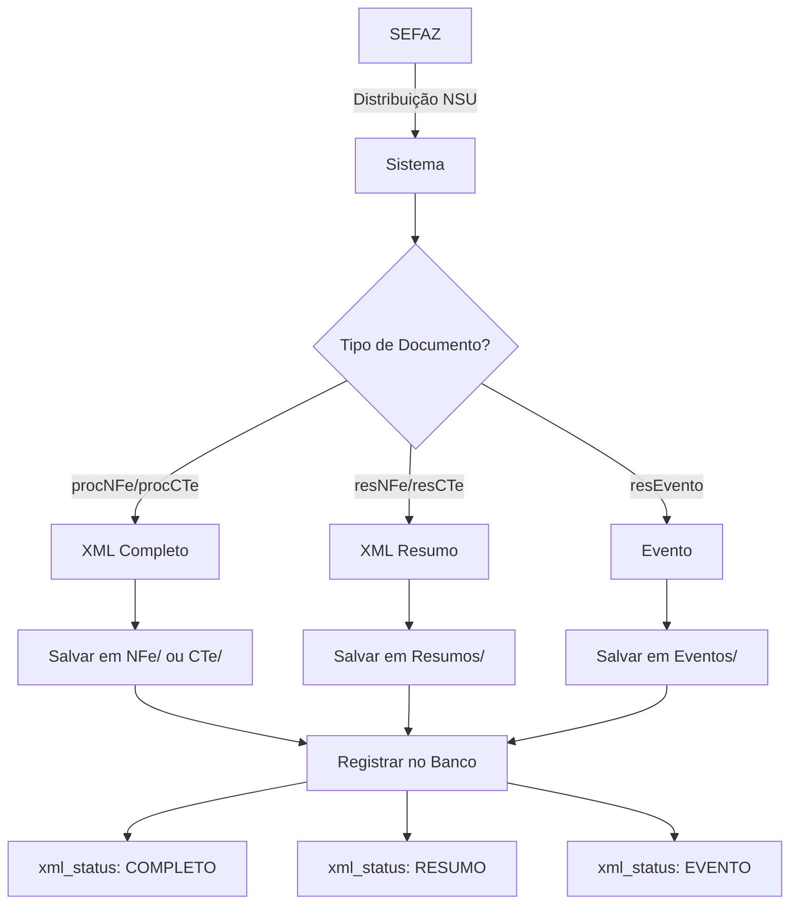

# 📦 Fluxo de Salvamento de XMLs

> **Documentação do Sistema de Backup Automático**  
> Versão 1.0.86 | Atualizado em: 07/01/2026

---

## 🎯 Resumo Executivo

**Todos os XMLs são salvos IMEDIATAMENTE durante o download via distribuição NSU**, incluindo:
- ✅ XMLs completos (`procNFe`, `procCTe`)
- ✅ XMLs resumidos (`resNFe`, `resCTe`)
- ✅ Eventos (`resEvento`, `procEventoNFe`)

**Não há dependência da auto-verificação para backup!** O sistema garante backup completo durante a distribuição.

---

## 📂 Estrutura de Armazenamento

### Organização Hierárquica

```
xmls/
├── {CNPJ_CERTIFICADO}/
│   ├── {ANO-MES}/
│   │   ├── NFe/
│   │   │   └── {CHAVE_44_DIGITOS}.xml        ← NFe completas (procNFe)
│   │   ├── CTe/
│   │   │   └── {CHAVE_44_DIGITOS}.xml        ← CTe completas (procCTe)
│   │   ├── Resumos/
│   │   │   └── {CHAVE_44_DIGITOS}.xml        ← Resumos (resNFe/resCTe)
│   │   ├── Eventos/
│   │   │   └── {CHAVE}_{TIPO}_{SEQ}.xml      ← Eventos (cancelamento, CCe, etc.)
│   │   └── Outros/
│   │       └── {NOME_ARQUIVO}.xml            ← Tipos não identificados
│   └── 2025-08/
│       ├── NFe/
│       ├── CTe/
│       └── ...
└── 12345678000199/
    └── 2026-01/
        ├── NFe/
        ├── Resumos/
        └── Eventos/
```

### Exemplo Real

```
xmls/
└── 47539664000197/
    └── 2025-08/
        ├── NFe/
        │   ├── 52260115045348000172570010014777191002562584.xml  ← Completa
        │   └── 52260115045348000172570010014777201002562585.xml
        ├── CTe/
        │   ├── 35250847539664000197570000000295111000295117.xml  ← Completo
        │   └── 35250847539664000197570000000295121000295118.xml
        ├── Resumos/
        │   └── 52260118956789000154550010001234561001234567.xml  ← Resumo (emitida)
        └── Eventos/
            ├── 52260115045348000172570010014777191002562584_110111_1.xml  ← Cancelamento
            └── 52260115045348000172570010014777191002562584_110110_1.xml  ← Carta Correção
```

---

## 🔄 Fluxo de Processamento NSU

### 1. Download via Distribuição NF-e/CT-e



### 2. Código de Salvamento (nfe_search.py)

**Localização**: `nfe_search.py`, linhas 292-310

```python
# Durante processamento de cada docZip da distribuição NSU:

# 1️⃣ Determina o tipo de documento
if root_tag in ['nfeProc', 'cteProc', 'NFe', 'CTe']:
    xml_status = 'COMPLETO'
elif root_tag == 'resNFe':
    xml_status = 'RESUMO'
elif root_tag in ['resEvento', 'procEventoNFe', 'evento']:
    xml_status = 'EVENTO'

# 2️⃣ SEMPRE salva em xmls/ (backup local) e obtém o caminho
caminho_xml = salvar_xml_por_certificado(
    xml, 
    cnpj, 
    pasta_base="xmls", 
    nome_certificado=nome_cert
)

# 3️⃣ Registra XML no banco COM o caminho do arquivo
if caminho_xml:
    db.registrar_xml(chave, cnpj, caminho_xml)
else:
    db.registrar_xml(chave, cnpj)
    logger.warning(f"⚠️ XML salvo mas caminho não obtido: {chave}")

# 4️⃣ Salva nota detalhada com status correto
nota['informante'] = inf
nota['xml_status'] = xml_status  # COMPLETO, RESUMO ou EVENTO
db.salvar_nota_detalhada(nota)
```

### 3. Tabelas do Banco de Dados

#### `xmls_baixados`
| Coluna | Tipo | Descrição |
|--------|------|-----------|
| `chave` | TEXT PRIMARY KEY | Chave de acesso (44 dígitos) |
| `cnpj_cpf` | TEXT | CNPJ/CPF do certificado |
| `caminho_arquivo` | TEXT | Caminho absoluto do XML salvo |
| `baixado_em` | DATETIME | Data/hora do download |

#### `notas_detalhadas`
| Coluna | Descrição | Valores |
|--------|-----------|---------|
| `chave` | Chave de acesso | 44 dígitos |
| `xml_status` | Status do XML | `COMPLETO`, `RESUMO`, `EVENTO` |
| `informante` | CNPJ do certificado | Organizador da pasta |
| `...` | Outros campos | número, valor, data, etc. |

---

## 🔍 Auto-Verificação: O que Faz?

### ⚠️ **IMPORTANTE**: Auto-verificação NÃO salva XMLs inicialmente!

A auto-verificação é um **complemento** que:

1. **Busca notas com status `RESUMO`** na tabela `notas_detalhadas`
2. **Consulta SEFAZ** usando `fetch_prot_nfe(chave)` ou `fetch_prot_cte(chave)`
3. **Se encontrar XML completo**:
   - Atualiza `xml_status` para `COMPLETO`
   - Salva XML completo na pasta apropriada (`NFe/` ou `CTe/`)
   - Registra na tabela `notas_verificadas`
4. **Se NÃO encontrar** (erro 217):
   - Marca como `nao_encontrado` em `notas_verificadas`
   - Nota permanece com status `RESUMO`

### Quando acontece erro 217?

```
cStat: 217 - NF-e não consta na base de dados da SEFAZ
```

**Causas comuns**:
- ✅ **Normal**: Nota foi **emitida** pelo CNPJ (você é o emissor)
- ✅ **Normal**: Nota ainda não foi autorizada pela SEFAZ
- ⚠️ **Atenção**: UF divergente (nota de outra UF)

**Resumos de notas emitidas são esperados e corretos!**

---

## 📋 Tipos de Documentos e Status

### Documentos Recebidos (Você é o Destinatário)

| NSU Retorna | Tipo | xml_status | Pasta | Auto-verificação |
|-------------|------|------------|-------|------------------|
| `procNFe` | NFe completa | `COMPLETO` | `NFe/` | ✅ Não necessária |
| `procCTe` | CTe completa | `COMPLETO` | `CTe/` | ✅ Não necessária |

### Documentos Emitidos (Você é o Emissor)

| NSU Retorna | Tipo | xml_status | Pasta | Auto-verificação |
|-------------|------|------------|-------|------------------|
| `resNFe` | Resumo NFe | `RESUMO` | `Resumos/` | ⚠️ Erro 217 esperado |
| `resCTe` | Resumo CTe | `RESUMO` | `Resumos/` | ⚠️ Erro 217 esperado |

### Eventos

| NSU Retorna | Tipo | xml_status | Pasta | Descrição |
|-------------|------|------------|-------|-----------|
| `resEvento` | Evento | `EVENTO` | `Eventos/` | Cancelamento, CCe, Manifestação |
| `procEventoNFe` | Evento processado | `EVENTO` | `Eventos/` | Evento com protocolo |

---

## 🔐 Backup Redundante (Opcional)

### Configuração de Armazenamento Secundário

O sistema permite configurar **backup adicional** além da pasta `xmls/`:

```python
# Configuração no banco de dados
db.set_config('storage_pasta_base', 'D:/Backup_NFe')

# Durante processamento NSU:
pasta_storage = db.get_config('storage_pasta_base', 'xmls')
if pasta_storage and pasta_storage != 'xmls':
    salvar_xml_por_certificado(
        xml, 
        cnpj, 
        pasta_base=pasta_storage,  # Ex: D:/Backup_NFe
        nome_certificado=nome_cert
    )
```

**Resultado**: XMLs salvos em **2 locais simultaneamente**:
1. `xmls/` (backup local - sempre)
2. `D:/Backup_NFe/` (backup adicional - se configurado)

---

## 🛠️ Casos Especiais

### 1. XMLs que NÃO são salvos

**Protocolos de consulta sem dados da nota**:

```python
# Exemplo: retConsSitCTe (apenas protocolo, sem dados)
is_only_protocol = (
    '<retconssit' in xml_lower and 
    '<protnfe' in xml_lower and
    '<nfeproc' not in xml_lower
)

if is_only_protocol:
    logger.warning("XML contém apenas protocolo, não será salvo")
    return None  # NÃO salva
```

**Motivo**: Protocolos não contêm dados úteis da nota, apenas status de processamento.

### 2. Nomenclatura de Eventos

Eventos são salvos com nomenclatura especial:

```
{CHAVE}_{TIPO_EVENTO}_{SEQUENCIA}.xml

Exemplos:
- 52260115045348000172570010014777191002562584_110111_1.xml  ← Cancelamento
- 52260115045348000172570010014777191002562584_110110_1.xml  ← Carta Correção
- 52260115045348000172570010014777191002562584_210200_1.xml  ← Confirmação
```

**Mapeamento de Eventos**:
- `110110` → Carta de Correção
- `110111` → Cancelamento
- `210200` → Confirmação da Operação
- `210210` → Ciência da Operação
- `210220` → Desconhecimento da Operação
- `210240` → Operação não Realizada

### 3. Extração de Data para Resumos

Resumos (`resNFe`/`resCTe`) não possuem tag `<dhEmi>`, então a data é **extraída da chave**:

```python
# Chave: 52260118956789000154550010001234561001234567
#        ^^AAMMDD (posições 2-8)
#        5226 = UF+Ano+Mês = SP/2026/Janeiro

ano = "20" + chave[2:4]  # "2026"
mes = chave[4:6]          # "01"
data_raw = f"{ano}-{mes}-01"  # "2026-01-01"

# Pasta: xmls/47539664000197/2026-01/Resumos/
```

---

## 📊 Estatísticas e Monitoramento

### Verificar XMLs Salvos

```sql
-- Total de XMLs baixados
SELECT COUNT(*) FROM xmls_baixados;

-- XMLs por status
SELECT xml_status, COUNT(*) 
FROM notas_detalhadas 
GROUP BY xml_status;

-- XMLs sem caminho (problema)
SELECT COUNT(*) 
FROM xmls_baixados 
WHERE caminho_arquivo IS NULL;
```

### Logs do Sistema

Durante processamento NSU, o sistema registra:

```log
[INFO] NSU avançou para 47539664000197: 000000000123456 → 000000000123460
[DEBUG] ✅ [47539664000197] NFe NSU 000000000123457: chave=52260115045348...
[DEBUG] 💾 [47539664000197] NFe 52260115045348...: Salvando em xmls/ (backup)...
[DEBUG] 📝 [47539664000197] NFe 52260115045348...: Extraindo nota detalhada...
[DEBUG] 💾 [47539664000197] NFe 52260115045348...: Salvando nota detalhada...
[INFO] ✅ [47539664000197] NFe processado: NSU=000000000123457, chave=52260115045348...
```

---

## ✅ Checklist de Validação

Use este checklist para validar que o sistema está funcionando corretamente:

- [ ] XMLs completos salvos em `xmls/{CNPJ}/ANO-MES/NFe/` ou `/CTe/`
- [ ] XMLs resumidos salvos em `xmls/{CNPJ}/ANO-MES/Resumos/`
- [ ] Eventos salvos em `xmls/{CNPJ}/ANO-MES/Eventos/`
- [ ] Tabela `xmls_baixados` possui campo `caminho_arquivo` preenchido
- [ ] Tabela `notas_detalhadas` possui `xml_status` correto (COMPLETO/RESUMO/EVENTO)
- [ ] Logs mostram "💾 Salvando em xmls/ (backup)..." durante NSU
- [ ] Auto-verificação só processa notas com status `RESUMO`
- [ ] Erro 217 aparece apenas para notas emitidas (esperado)

---

## 🔧 Manutenção

### Corrigir Caminhos Faltantes

Se houver XMLs sem `caminho_arquivo` na tabela `xmls_baixados`:

```bash
python corrigir_caminhos_xmls.py
```

Este script:
1. Busca XMLs com `caminho_arquivo = NULL`
2. Procura o arquivo no sistema de arquivos
3. Atualiza o banco com o caminho correto

### Limpeza de Arquivos Órfãos

Para remover XMLs que não estão no banco:

```python
# TODO: Criar script de limpeza
# Compara arquivos em xmls/ com registros em xmls_baixados
# Remove arquivos sem registro no banco
```

---

## 📚 Arquivos Relacionados

| Arquivo | Descrição |
|---------|-----------|
| [`nfe_search.py`](nfe_search.py) | Lógica de distribuição NSU e salvamento |
| [`Busca NF-e.py`](Busca NF-e.py) | Interface e auto-verificação |
| [`corrigir_caminhos_xmls.py`](corrigir_caminhos_xmls.py) | Correção de caminhos faltantes |
| [`PADRAO_ARQUIVAMENTO.md`](PADRAO_ARQUIVAMENTO.md) | Detalhes do padrão de organização |

---

## ❓ FAQ

### P: Resumos são salvos durante NSU ou só após auto-verificação?
**R**: ✅ Salvos **IMEDIATAMENTE** durante NSU em `xmls/{CNPJ}/ANO-MES/Resumos/`

### P: O que acontece se a auto-verificação falhar?
**R**: Nada! Os resumos já estão salvos e seguros. A auto-verificação apenas tenta buscar a versão completa.

### P: Por que tenho resumos com erro 217?
**R**: Normal! Erro 217 significa que você é o **emissor** da nota, não o destinatário. A SEFAZ só permite consulta completa para destinatários.

### P: Como garantir que todos os XMLs têm backup?
**R**: Verifique que `caminho_arquivo` está preenchido em `xmls_baixados`. Se não, rode `corrigir_caminhos_xmls.py`.

### P: Posso deletar a pasta `Resumos/` se já tenho os completos?
**R**: ⚠️ Não recomendado! Resumos de notas **emitidas** são o único registro que você tem dessas notas.

### P: A pasta `Eventos/` é importante?
**R**: ✅ Sim! Contém cancelamentos, cartas de correção e manifestações. Essencial para auditoria.

---

## 📝 Changelog

### Versão 1.0.86 (07/01/2026)
- ✅ Sistema salva XMLs imediatamente durante NSU
- ✅ Organização hierárquica por CNPJ/ANO-MES/TIPO
- ✅ Campo `caminho_arquivo` em `xmls_baixados`
- ✅ Status `xml_status` correto (COMPLETO/RESUMO/EVENTO)
- ✅ Auto-verificação movida para Gerenciador de Trabalhos (QThread)

### Versão Anterior
- ❌ `caminho_arquivo` não era salvo
- ❌ Auto-verificação travava a interface
- ❌ Sem distinção clara entre COMPLETO/RESUMO

---

## 🎓 Conclusão

O sistema de backup automático garante:
1. **Salvamento imediato** durante distribuição NSU
2. **Organização hierárquica** por CNPJ e data
3. **Rastreabilidade completa** via banco de dados
4. **Redundância opcional** com backup secundário
5. **Auto-verificação inteligente** para complementar resumos

**Todos os XMLs estão protegidos desde o momento do download!** ✅

---

*Documentação mantida por: Sistema NFe/CTe*  
*Última atualização: 07/01/2026*
