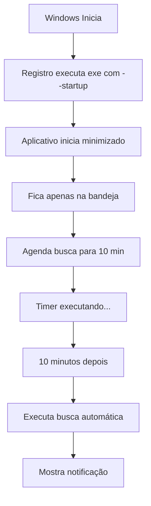

# Inicialização Automática e Gerenciador de Tarefas

## 📋 Funcionalidades Implementadas

### 1. **Inicialização Automática com Windows**

O sistema agora pode iniciar automaticamente quando o Windows é iniciado.

#### Como Habilitar:

**Opção 1 - Durante a Instalação:**
- Durante a instalação do programa, marque a opção:
  ☑️ "Iniciar automaticamente com o Windows"

**Opção 2 - Dentro do Aplicativo:**
1. Clique com botão direito no ícone da bandeja do sistema (system tray)
2. Selecione "Iniciar com Windows"
3. Confirme a mensagem

**Opção 3 - Manualmente:**
- Execute o programa normalmente
- O sistema aparecerá em: **Configurações > Aplicativos > Inicialização**

#### Como Desabilitar:
- Clique novamente na opção "Iniciar com Windows" no menu da bandeja
- OU desabilite em: Configurações do Windows > Aplicativos > Inicialização

---

### 2. **Ícone na Bandeja do Sistema (System Tray)**

Quando minimizado, o aplicativo fica na bandeja do sistema ao invés de fechar.

#### Menu da Bandeja:
- **Mostrar/Ocultar**: Alterna visualização da janela principal
- **🔄 Buscar Notas Agora**: Executa busca imediatamente
- **⏱️ Gerenciador de Tarefas**: Abre janela de gerenciamento
- **Iniciar com Windows**: Habilita/desabilita startup automático
- **Sair**: Fecha completamente o aplicativo

#### Comportamento:
- **Clique duplo** no ícone: Mostra/oculta a janela
- **Fechar janela (X)**: Minimiza para bandeja (não fecha)
- **Sair do menu**: Fecha completamente

---

### 3. **Busca Automática Agendada (10 minutos)**

Quando iniciado automaticamente com o Windows, o sistema agenda uma busca para **10 minutos** após a inicialização.

#### Características:
- ⏱️ Execução agendada para 600 segundos (10 minutos)
- 📊 Aparece no **Gerenciador de Tarefas**
- ❌ Pode ser cancelada pelo usuário
- 🔔 Notificação ao concluir

#### Notificações:
- **Ao iniciar**: "Busca automática será executada em 10 minutos"
- **Ao executar**: "Buscando novas notas fiscais..."
- **Ao concluir**: "A busca por novas notas foi executada com sucesso"

---

### 4. **Gerenciador de Tarefas Agendadas**

Janela dedicada para visualizar e gerenciar todas as tarefas agendadas.

#### Recursos:
- 📋 Lista todas as tarefas ativas
- ⏱️ Mostra tempo restante em tempo real
- ▶️ Indica status (Agendada / Em execução / Cancelada)
- ❌ Permite cancelar tarefas individualmente
- 🔄 Atualização automática a cada segundo

#### Colunas:
1. **Tarefa**: Nome da tarefa agendada
2. **Agendada Para**: Data e hora de execução
3. **Tempo Restante**: Countdown em tempo real
4. **Status**: Estado atual da tarefa

#### Como Acessar:
- Menu da bandeja > "⏱️ Gerenciador de Tarefas"
- Atalho de teclado (se implementado)

---

## 🚀 Argumentos de Linha de Comando

### `--startup`
Inicia o aplicativo em modo startup (minimizado para bandeja).

**Uso:**
```bash
"Busca XML.exe" --startup
```

**Comportamento:**
- Não mostra a janela principal
- Fica apenas na bandeja do sistema
- Agenda busca automática para 10 minutos
- Mostra notificação de inicialização

### `--minimized`
Inicia minimizado (similar ao --startup).

**Uso:**
```bash
"Busca XML.exe" --minimized
```

---

## 📁 Arquivos Relacionados

### Novos Módulos:
- **`modules/startup_manager.py`**: Gerencia registro do Windows
- **`modules/task_scheduler.py`**: Sistema de tarefas agendadas
- **`modules/task_manager_dialog.py`**: Interface do gerenciador

### Arquivos Atualizados:
- **`Busca NF-e.py`**: Implementação principal
- **`BOT_Busca_NFE.spec`**: Configuração de build
- **`installer.iss`**: Configuração do instalador
- **`build.bat`**: Script de compilação

---

## 🔧 Registro do Windows

### Local da Entrada:
```
HKEY_CURRENT_USER\Software\Microsoft\Windows\CurrentVersion\Run
```

### Nome da Chave:
```
BOT Busca NFE
```

### Valor (Exemplo):
```
"C:\Program Files\Busca XML\Busca XML.exe" --startup
```

---

## 📊 Fluxo de Inicialização Automática



---

## ⚙️ Configurações do Usuário

As preferências são salvas em:
```
QSettings('NFE_System', 'BOT_NFE')
```

### Chaves Relevantes:
- `display/limit`: Limite de documentos exibidos
- `window/geometry`: Posição e tamanho da janela
- (Futuramente) `startup/auto_search`: Habilitar busca automática

---

## 🐛 Troubleshooting

### Aplicativo não inicia automaticamente:
1. Verifique em: Configurações > Aplicativos > Inicialização
2. Certifique-se que está habilitado
3. Verifique o registro:
   ```
   reg query "HKCU\Software\Microsoft\Windows\CurrentVersion\Run" /v "BOT Busca NFE"
   ```

### Ícone na bandeja não aparece:
- Verifique se o `Logo.ico` existe na pasta de instalação
- Reinicie o aplicativo
- Verifique configurações de ícones ocultos do Windows

### Busca automática não executa:
1. Abra o **Gerenciador de Tarefas** (menu da bandeja)
2. Verifique se a tarefa está listada
3. Confira o tempo restante
4. Se cancelada acidentalmente, reinicie o aplicativo

### Como remover completamente:
1. Desinstale pelo Painel de Controle
2. Durante a desinstalação, escolha "Não" para remover dados
3. Ou manualmente delete:
   ```
   %APPDATA%\BOT Busca NFE
   ```

---

## 📝 Notas de Desenvolvimento

### Tecnologias Utilizadas:
- **PyQt5**: Interface gráfica e system tray
- **QTimer**: Agendamento de tarefas
- **winreg**: Manipulação do registro do Windows
- **argparse**: Argumentos de linha de comando

### Threads e Segurança:
- Tarefas são executadas na thread principal (UI thread)
- Sistema de cancelamento thread-safe
- Cleanup automático de tarefas concluídas

### Melhorias Futuras:
- [ ] Configurar intervalo personalizado (não apenas 10 min)
- [ ] Múltiplas tarefas agendadas diferentes
- [ ] Histórico de execuções
- [ ] Logs de tarefas agendadas
- [ ] Notificações configuráveis

---

## 📄 Changelog

### v1.1.0 (Janeiro 2026)
- ✅ Implementada inicialização automática com Windows
- ✅ Adicionado ícone na bandeja do sistema (system tray)
- ✅ Criado gerenciador de tarefas agendadas
- ✅ Busca automática 10 minutos após startup
- ✅ Argumentos de linha de comando (--startup, --minimized)
- ✅ Integração com instalador (Inno Setup)
- ✅ Documentação completa

---

## 🆘 Suporte

Para problemas ou dúvidas:
- **Site**: https://dwmsystems.up.railway.app/
- **Email**: suporte@dwmsystems.com
- **Desenvolvedor**: DWM System Developer
