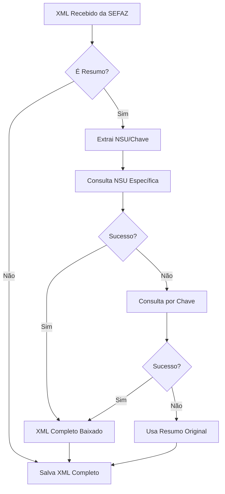

# 📄 DOWNLOAD AUTOMÁTICO DE XMLs COMPLETOS

## 🎯 **NOVA FUNCIONALIDADE IMPLEMENTADA**

O sistema agora detecta automaticamente quando recebe **resumos NFe (resNFe)** e tenta baixar os **XMLs completos (procNFe)** correspondentes.

---

## 🔄 **COMO FUNCIONA**

### **1. Detecção Automática**
- ✅ Sistema detecta se o XML recebido é um **resumo** (resNFe)
- ✅ Se for resumo, **automaticamente** tenta baixar o XML completo
- ✅ Se já for completo, **continua normalmente**

### **2. Métodos de Download**
O sistema usa **dois métodos** para baixar XMLs completos:

#### **Método 1: Consulta NSU Específica**
```xml
<distDFeInt>
  <consNSU>
    <NSU>000000000012345</NSU>
  </consNSU>
</distDFeInt>
```

#### **Método 2: Consulta por Chave**
```xml
<consSitNFe>
  <chNFe>35200814200166000187550010000000671192808123</chNFe>
</consSitNFe>
```

---

## 🚀 **ATIVAÇÃO DA FUNCIONALIDADE**

### **Automática (Recomendado)**
A funcionalidade já está **integrada** no fluxo normal:
- ✅ **Busca automática** (a cada 60 minutos)
- ✅ **Busca manual** (botão "Buscar Novas NFe")

### **Manual (Interface)**
1. 📋 **Menu NF-e** → **"Baixar XMLs Completos"**
2. 🔄 Confirma a operação
3. ⏳ Aguarda processamento

---

## 📊 **FUNCIONAMENTO DETALHADO**

### **Fluxo de Processamento:**



### **Logs Informativos:**
```log
INFO - Detectado resumo NFe no NSU 123456 - tentando baixar XML completo
INFO - ✅ XML completo baixado com sucesso para NSU 123456
WARNING - ⚠️ Não foi possível baixar XML completo para NSU 123456, usando resumo
```

---

## ⚙️ **CONFIGURAÇÃO**

### **Certificados Necessários**
- ✅ Certificados devem estar **configurados** no sistema
- ✅ UF deve estar **definida** para cada certificado
- ✅ Certificados devem estar **ativos** no SEFAZ

### **Verificação de Status**
O sistema verifica:
1. **Se já tem XML completo** → Não baixa novamente
2. **Se nota está autorizada** → Status 100
3. **Se certificado é válido** → Para a UF correspondente

---

## 📁 **ESTRUTURA DE ARQUIVOS**

### **XMLs Salvos Organizadamente:**
```
xmls/
├── 12345678000123/           # CNPJ do emitente
│   ├── 2025-01/             # Ano-Mês
│   │   ├── 001-EMPRESA.xml  # XML COMPLETO baixado
│   │   └── 002-LOJA.xml     # XML COMPLETO baixado
│   └── 2025-02/
└── 98765432000198/
```

### **Tipos de XML Suportados:**
- ✅ **resNFe** → Resumo (será convertido)
- ✅ **procNFe** → Documento completo com protocolo
- ✅ **NFe** → Documento fiscal eletrônico
- ✅ **resEvento** → Resumo de evento
- ✅ **procEvento** → Evento completo

---

## 🎯 **VANTAGENS**

### **Para o Usuário:**
1. 📊 **Dados Completos:** Acesso a todos os campos da NFe
2. 🏷️ **Produtos Detalhados:** Lista completa de itens
3. 💰 **Impostos Precisos:** ICMS, IPI, PIS, COFINS detalhados
4. 📄 **Conformidade:** XMLs válidos para contabilidade

### **Para o Sistema:**
1. 🔄 **Automático:** Sem intervenção manual
2. 📈 **Inteligente:** Só baixa quando necessário
3. 🚀 **Performático:** Cache e verificações otimizadas
4. 🛡️ **Robusto:** Fallback para resumos quando necessário

---

## 🔧 **MONITORAMENTO**

### **Interface Visual:**
- 📊 **Status Bar:** Mostra progresso do download
- 📋 **Logs:** Registra todas as operações
- ✅ **Notificações:** Informa sucessos e falhas

### **Arquivos de Log:**
```log
2025-01-15 10:30:15 - INFO - Iniciando download de XMLs completos...
2025-01-15 10:30:16 - INFO - Processando certificado: 12345678000123
2025-01-15 10:30:18 - INFO - ✅ XML completo baixado para NSU 123456
2025-01-15 10:30:20 - WARNING - ⚠️ Resumo mantido para NSU 123457 (SEFAZ indisponível)
2025-01-15 10:30:22 - INFO - Download concluído: 15 XMLs convertidos
```

---

## 🚨 **TROUBLESHOOTING**

### **Problemas Comuns:**

#### **"Não consegue baixar XML completo"**
- ✅ Verifica se certificado está válido
- ✅ Verifica se UF está configurada
- ✅ Verifica conexão com SEFAZ
- ✅ Verifica se NSU existe

#### **"XML resumo sendo usado"**
- ⚠️ **Normal:** Quando SEFAZ está indisponível
- ⚠️ **Normal:** Quando documento não tem versão completa
- ⚠️ **Normal:** Quando há erro temporário de rede

### **Códigos de Status:**
- **100:** Autorizada (XML completo disponível)
- **656:** Consumo indevido (aguardar)
- **138:** Documento inexistente
- **999:** Erro interno

---

## 🎉 **RESULTADO FINAL**

✅ **Sistema totalmente automático** para conversão de resumos em XMLs completos
✅ **Máxima compatibilidade** com sistemas existentes
✅ **Zero intervenção manual** necessária
✅ **Fallback inteligente** para resumos quando necessário
✅ **Performance otimizada** com cache e verificações

**🚀 Agora você tem acesso aos XMLs completos automaticamente!**