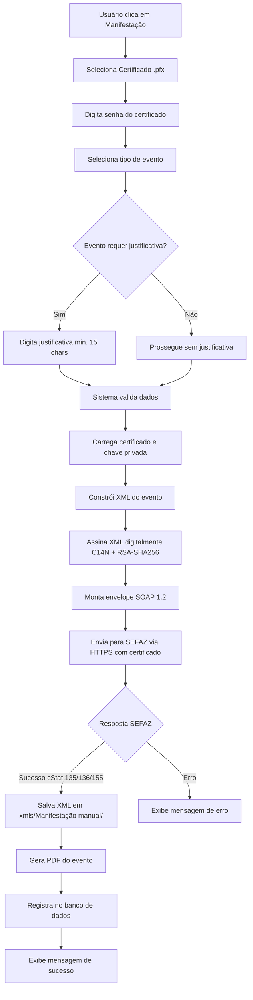

# Documentação - Sistema de Manifestação de Documentos Fiscais

## 📋 Sumário

1. [Visão Geral](#visão-geral)
2. [Tipos de Eventos](#tipos-de-eventos)
3. [Fluxo de Funcionamento](#fluxo-de-funcionamento)
4. [Estrutura Técnica](#estrutura-técnica)
5. [Endpoints SEFAZ](#endpoints-sefaz)
6. [Troubleshooting](#troubleshooting)
7. [Exemplos de Uso](#exemplos-de-uso)

---

## 🎯 Visão Geral

O sistema de manifestação permite registrar eventos relacionados a documentos fiscais eletrônicos (NF-e e CT-e) junto à SEFAZ, comunicando situações como:

- ✅ Ciência da operação
- ✅ Confirmação da operação
- ❌ Desconhecimento da operação
- ❌ Operação não realizada
- ❌ Prestação de serviço em desacordo (CT-e)
- ❌ Prestação de serviço não prestada (CT-e)

### Requisitos

- **Certificado Digital A1** (.pfx) válido
- **Senha do certificado**
- **Chave de acesso** do documento (44 dígitos)
- **Justificativa** (obrigatória para eventos de desacordo/desconhecimento - mín. 15 caracteres)

---

## 📝 Tipos de Eventos

### NF-e (Nota Fiscal Eletrônica)

| Código | Evento | Justificativa |
|--------|--------|---------------|
| 210210 | Ciência da Operação | ❌ Não |
| 210200 | Confirmação da Operação | ❌ Não |
| 210220 | Desconhecimento da Operação | ✅ Sim (mín. 15 char) |
| 210240 | Operação não Realizada | ✅ Sim (mín. 15 char) |

### CT-e (Conhecimento de Transporte Eletrônico)

| Código | Evento | Justificativa |
|--------|--------|---------------|
| 610110 | Prestação do Serviço em Desacordo | ✅ Sim (mín. 15 char) |
| 610112 | Prestação do Serviço não Prestada | ✅ Sim (mín. 15 char) |

---

## 🔄 Fluxo de Funcionamento



---

## 🔧 Estrutura Técnica

### Arquitetura

```
interface_pyqt5.py
    └─> modules/manifestacao_service.py
            ├─> ManifestacaoService.__init__()
            │       └─> Carrega certificado .pfx
            ├─> ManifestacaoService.assinar_xml()
            │       ├─> Canonicalização C14N
            │       ├─> Digest SHA256
            │       ├─> Assinatura RSA-SHA256
            │       └─> Retorna XML assinado (sem declaração)
            └─> ManifestacaoService.enviar_manifestacao()
                    ├─> Constrói XML do evento
                    ├─> Chama assinar_xml()
                    ├─> Monta SOAP envelope
                    ├─> POST HTTPS com certificado
                    └─> Parse resposta SEFAZ
```

### Assinatura Digital (XMLDSig)

1. **Canonicalização**: XML é convertido para formato C14N (Canonical XML)
2. **Digest**: Calcula SHA256 do XML canonicalizado
3. **SignedInfo**: Cria estrutura com digest e algoritmos
4. **Assinatura**: Assina SignedInfo com chave privada RSA-SHA256
5. **Embedding**: Insere assinatura e certificado X509 no XML

**Algoritmos utilizados:**
- Canonicalização: `http://www.w3.org/TR/2001/REC-xml-c14n-20010315`
- Digest: `http://www.w3.org/2001/04/xmlenc#sha256`
- Assinatura: `http://www.w3.org/2001/04/xmldsig-more#rsa-sha256`

### Envelope SOAP 1.2

#### Para NF-e:
```xml
<soap12:Envelope xmlns:soap12="http://www.w3.org/2003/05/soap-envelope">
    <soap12:Body>
        <nfeDadosMsg xmlns="http://www.portalfiscal.inf.br/nfe/wsdl/NFeRecepcaoEvento4">
            <!-- XML assinado aqui (sem declaração XML) -->
        </nfeDadosMsg>
    </soap12:Body>
</soap12:Envelope>
```

**Headers HTTP:**
- `Content-Type: application/soap+xml; charset=utf-8`
- `SOAPAction: "http://www.portalfiscal.inf.br/nfe/wsdl/NFeRecepcaoEvento4/nfeRecepcaoEvento"`

#### Para CT-e:
```xml
<soap12:Envelope xmlns:soap12="http://www.w3.org/2003/05/soap-envelope">
    <soap12:Body>
        <cteDadosMsg xmlns="http://www.portalfiscal.inf.br/cte/wsdl/CteRecepcaoEvento">
            <!-- XML assinado aqui (sem declaração XML) -->
        </cteDadosMsg>
    </soap12:Body>
</soap12:Envelope>
```

**Headers HTTP:**
- `Content-Type: application/soap+xml; charset=utf-8`
- `SOAPAction: "http://www.portalfiscal.inf.br/cte/wsdl/CteRecepcaoEvento/cteRecepcaoEvento"`

---

## 🌐 Endpoints SEFAZ

### NF-e - Recepção de Eventos (27 UFs)

Todos os estados usam o mesmo padrão de URL para NF-e:
```
https://[dominio_uf]/nfe/wsdl/NFeRecepcaoEvento4
```

Exemplo: 
- SP: `https://nfe.fazenda.sp.gov.br/ws/nferecepcaoevento4.asmx`
- MG: `https://nfe.fazenda.mg.gov.br/nfe2/services/NFeRecepcaoEvento4`

### CT-e - Recepção de Eventos (27 UFs)

#### Estados com webservice próprio:

| UF | Estado | URL |
|----|--------|-----|
| 31 | MG | `https://cte.fazenda.mg.gov.br/cte/services/CTeRecepcaoEvento` |
| 35 | SP | `https://nfe.fazenda.sp.gov.br/cteWEB/services/cteRecepcaoEvento.asmx` |
| 43 | RS | `https://cte.sefazrs.rs.gov.br/ws/cterecepcaoevento/cterecepcaoevento.asmx` |
| 50 | MS | `https://producao.cte.ms.gov.br/ws/CTeRecepcaoEvento` |

#### Estados usando SVRS (Sefaz Virtual RS):

**⚠️ URL EM INVESTIGAÇÃO - MÚLTIPLAS TENTATIVAS**

15 estados usam o SVRS. URLs testadas:

1. ❓ `https://cte.svrs.rs.gov.br/ws/CteRecepcaoEvento/CteRecepcaoEvento.asmx`
2. ❓ `https://cte.svrs.rs.gov.br/ws/CTeRecepcaoEventoV4/CTeRecepcaoEventoV4.asmx`
3. ❓ `https://cte.svrs.rs.gov.br/ws/cterecepcaoevento/cterecepcaoevento.asmx`

**Estados SVRS:**
- 11 (RO), 12 (AC), 13 (AM), 14 (RR), 15 (PA)
- 16 (AP), 17 (TO), 21 (MA), 22 (PI), 23 (CE)
- 24 (RN), 25 (PB), 26 (PE), 27 (AL), 28 (SE)
- 29 (BA), 32 (ES), 33 (RJ), 41 (PR), 42 (SC)
- 51 (MT), 52 (GO), 53 (DF)

---

## 🐛 Troubleshooting

### Erros Comuns

#### HTTP 404 - Not Found
```
Requested URL: /ws/CTeRecepcaoEvento/CTeRecepcaoEvento.asmx
```

**Causa:** URL incorreta ou serviço não existe naquele caminho

**Soluções:**
1. Verificar se o estado tem webservice próprio ou usa SVRS
2. Testar diferentes variações de capitalização (CteRecepcaoEvento vs CTeRecepcaoEvento)
3. Verificar se precisa da extensão `.asmx`

#### HTTP 500 - Invalid SOAPAction
```xml
<soap:Text>Unable to handle request without a valid action parameter</soap:Text>
```

**Causa:** Header `SOAPAction` incorreto ou namespace SOAP incompatível

**Soluções:**
1. Verificar se SOAPAction inclui a versão correta (v3, v4, etc)
2. Conferir se namespace do SOAP (`xmlns=`) corresponde ao SOAPAction
3. Garantir que operação está correta (cteRecepcaoEvento vs CteRecepcaoEvento)

#### HTTP 500 - Wrong Namespace
```
targetService is CteRecepcaoEvento
```

**Causa:** Usando namespace de NF-e (`nfeDadosMsg`) para CT-e ou vice-versa

**Solução:**
- NF-e: usar `<nfeDadosMsg xmlns="...nfe/wsdl/...">`
- CT-e: usar `<cteDadosMsg xmlns="...cte/wsdl/...">`

#### Erro de Certificado
```
SSL certificate problem: unable to get local issuer certificate
```

**Causa:** Cadeia de certificados incompleta ou certificado expirado

**Soluções:**
1. Verificar data de validade do certificado
2. Usar `verify=False` em ambiente de desenvolvimento (NÃO em produção)
3. Instalar cadeia completa de certificados

### cStat - Códigos de Status SEFAZ

| cStat | Descrição | Ação |
|-------|-----------|------|
| 135 | Evento registrado e vinculado à CT-e | ✅ Sucesso |
| 136 | Evento registrado, mas não vinculado | ⚠️ Aviso |
| 155 | Evento registrado com sucesso | ✅ Sucesso |
| 217 | CT-e não consta na base de dados | ❌ Chave inválida |
| 218 | Evento já registrado | ⚠️ Duplicado |
| 573 | Rejeição: CNPJ do emitente inválido | ❌ Certificado incorreto |

---

## 💡 Exemplos de Uso

### Exemplo 1: Ciência da Operação (NF-e)

```python
from modules.manifestacao_service import ManifestacaoService

# Inicializar serviço
service = ManifestacaoService(
    cert_path="certificado.pfx",
    cert_password="senha123"
)

# Enviar evento
resultado = service.enviar_manifestacao(
    chave="35240512345678901234567890123456789012345678",
    tipo_evento="210210",  # Ciência da Operação
    informante="12345678000195",
    justificativa=None  # Não obrigatória
)

print(f"Status: {resultado['cStat']}")
print(f"Protocolo: {resultado['protocolo']}")
```

### Exemplo 2: Desacordo do Serviço (CT-e)

```python
# Enviar evento com justificativa
resultado = service.enviar_manifestacao(
    chave="51251259126255000148570010000734411000948563",
    tipo_evento="610110",  # Desacordo do Serviço
    informante="07606538000193",
    justificativa="MOTIVO - TRANSPORTADORA EMITIU ERRONEAMENTE."
)
```

---

## 📁 Estrutura de Arquivos

### XMLs Salvos
```
xmls/
└── Manifestação manual/
    ├── evento_210210_35240512345...txt (Data e hora)
    ├── evento_610110_51251259126...txt
    └── ...
```

### PDFs Gerados
```
xmls/
└── Manifestação manual/
    ├── evento_210210_35240512345...pdf
    ├── evento_610110_51251259126...pdf
    └── ...
```

### Formato do PDF

- **Cabeçalho:** Tipo de evento e status
- **Dados do Documento:** Chave de acesso, UF, modelo
- **Dados do Evento:** Código, protocolo, data/hora
- **Justificativa:** (se aplicável)
- **Assinatura Digital:** Informações do certificado

---

## 🔐 Segurança

### Boas Práticas

1. **Certificado:**
   - Armazenar .pfx em local seguro
   - Não commitar certificados no Git
   - Usar senha forte
   - Renovar antes do vencimento

2. **Logs:**
   - Não logar senhas de certificados
   - Sanitizar dados sensíveis
   - Rotacionar logs regularmente

3. **Comunicação:**
   - Sempre usar HTTPS
   - Validar certificados da SEFAZ (exceto em dev)
   - Implementar timeout adequado

---

## 📚 Referências

- [Manual de Integração - NF-e](https://www.nfe.fazenda.gov.br/)
- [Manual de Integração - CT-e](https://www.cte.fazenda.gov.br/)
- [Portal Nacional da NF-e](http://www.nfe.fazenda.gov.br/portal/principal.aspx)
- [SEFAZ Virtual RS](https://dfe-portal.svrs.rs.gov.br/)

---

## 🔄 Histórico de Mudanças

### 2026-01-05
- ✅ Implementação inicial da manifestação
- ✅ Suporte para NF-e e CT-e
- ✅ Assinatura digital XMLDSig
- ✅ Geração de PDF
- ✅ Integração com SEFAZ
- ⏳ Investigação de URLs SVRS para CT-e (em andamento)

---

## 🆘 Suporte

Para problemas ou dúvidas:

1. Verificar logs em `logs/busca_nfe_YYYY-MM-DD.log`
2. Executar script de teste: `python test_manifestacao_urls.py`
3. Consultar esta documentação
4. Verificar status dos webservices SEFAZ

---

**Última atualização:** 05/01/2026
