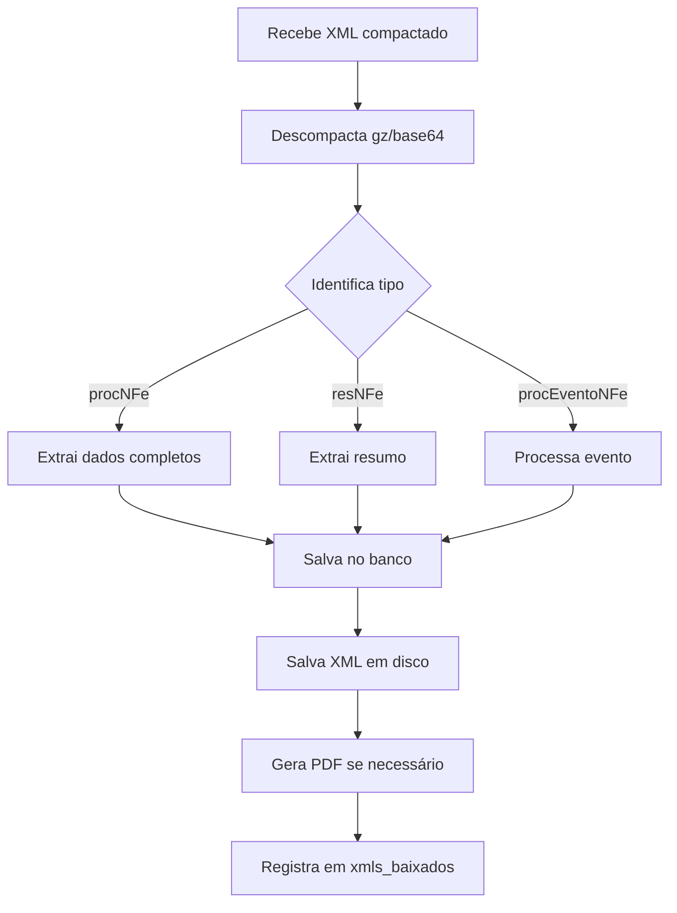

# 📘 Documentação Completa - Sistema de Busca NF-e e CT-e

**Data de Criação:** 17 de fevereiro de 2026  
**Versão do Sistema:** 2.0+  
**Finalidade:** Documentação técnica para exportação e integração web

---

## 📋 Índice

1. [Visão Geral](#visão-geral)
2. [Arquitetura do Sistema](#arquitetura-do-sistema)
3. [Busca de NF-e](#busca-de-nf-e)
4. [Busca de CT-e](#busca-de-ct-e)
5. [Fluxo de Dados](#fluxo-de-dados)
6. [Estrutura de Armazenamento](#estrutura-de-armazenamento)
7. [Modelos de Dados](#modelos-de-dados)
8. [Exemplos de Uso](#exemplos-de-uso)

---

## 🔍 Visão Geral

O sistema realiza busca automática de documentos fiscais eletrônicos através da **API DFe (Distribuição de Documentos Fiscais Eletrônicos)** da SEFAZ.

### Documentos Suportados

- **NF-e** (Nota Fiscal Eletrônica) - Modelo 55
- **CT-e** (Conhecimento de Transporte Eletrônico) - Modelo 57
- **NFS-e** (Nota Fiscal de Serviço Eletrônica)
- **Eventos** (Cancelamentos, Cartas de Correção, Manifestação do Destinatário)

### Características Principais

- ✅ Busca automática via certificado digital A1
- ✅ Processamento de XMLs completos e resumos
- ✅ Extração automática de dados estruturados
- ✅ Sistema de NSU (Número Sequencial Único) para controle
- ✅ Armazenamento em múltiplos perfis simultaneamente
- ✅ Geração automática de PDFs (DANFE/DACTE)
- ✅ Suporte a múltiplos certificados

---

## 🏗️ Arquitetura do Sistema

```
┌─────────────────────────────────────────────────────────────┐
│                    CAMADA DE ENTRADA                        │
│  • Certificados Digitais A1 (.pfx)                          │
│  • Agendamento Automático (run_single_cycle)                │
│  • Interface Manual (Busca por Chave)                       │
└──────────────────────┬──────────────────────────────────────┘
                       │
                       ▼
┌─────────────────────────────────────────────────────────────┐
│                 CAMADA DE COMUNICAÇÃO                       │
│  • consultar_ultimo_nsu_sefaz()                             │
│  • baixar_documentos_dfe()                                  │
│  • consultar_nfe_por_chave()                                │
│  • consultar_cte_por_chave()                                │
└──────────────────────┬──────────────────────────────────────┘
                       │
                       ▼
┌─────────────────────────────────────────────────────────────┐
│              CAMADA DE PROCESSAMENTO                        │
│  • processar_nfe()         → NFProcessor                    │
│  • processar_cte()         → CTProcessor                    │
│  • processar_eventos()     → EventProcessor                 │
│  • extrair_nota_detalhada() → DataExtractor                 │
└──────────────────────┬──────────────────────────────────────┘
                       │
                       ▼
┌─────────────────────────────────────────────────────────────┐
│               CAMADA DE ARMAZENAMENTO                       │
│  • salvar_xml_por_certificado() → FileSystem                │
│  • DatabaseManager.salvar_nota_detalhada() → SQLite         │
│  • gerar_danfe_pdf() / gerar_dacte_pdf() → PDF Generator    │
└─────────────────────────────────────────────────────────────┘
```

---

## 📄 Busca de NF-e

### Endpoint Principal: `processar_nfe()`

**Arquivo:** `nfe_search.py` (linhas ~3200-3900)

### Parâmetros de Entrada

```python
def processar_nfe(
    db: DatabaseManager,        # Instância do banco de dados
    cert_data: tuple            # (cnpj, caminho_pfx, senha, informante, cuf)
) -> dict
```

### Métodos de Busca

#### 1. Busca por NSU (Distribuição DFe)

```python
# Função: baixar_documentos_dfe()
# Localização: nfe_search.py linha ~2800

consultar_ultimo_nsu = consultar_ultimo_nsu_sefaz(
    cnpj=cnpj_cert,
    caminho_certificado=caminho,
    senha_certificado=senha,
    cuf=cuf
)

resultado = baixar_documentos_dfe(
    ultimo_nsu=nsu_atual,
    cnpj=cnpj_cert,
    caminho_certificado=caminho,
    senha_certificado=senha,
    max_nsu=nsu_maximo,
    cuf=cuf
)
```

**Retorno XML:**
```xml
<retDistDFeInt versao="1.01">
  <tpAmb>1</tpAmb>
  <cStat>138</cStat>
  <xMotivo>Documento localizado</xMotivo>
  <dhResp>2026-02-17T10:30:00-03:00</dhResp>
  <ultNSU>000000000123456</ultNSU>
  <maxNSU>000000000999999</maxNSU>
  <loteDistDFeInt>
    <docZip NSU="000000000123457" schema="resNFe_v1.01">
      <!-- XML compactado em base64 -->
    </docZip>
    <docZip NSU="000000000123458" schema="procNFe_v4.00">
      <!-- XML compactado em base64 -->
    </docZip>
  </loteDistDFeInt>
</retDistDFeInt>
```

#### 2. Busca por Chave de Acesso

```python
# Função: consultar_nfe_por_chave()
# Localização: nfe_search.py linha ~2200

xml_resposta = consultar_nfe_por_chave(
    chave="50260101773924000193550010000173831950403658",
    caminho_pfx=caminho,
    senha=senha,
    cnpj_cert=cnpj,
    cuf=50
)
```

**Request SOAP:**
```xml
<consSitNFe xmlns="http://www.portalfiscal.inf.br/nfe" versao="4.00">
  <tpAmb>1</tpAmb>
  <xServ>CONSULTAR</xServ>
  <chNFe>50260101773924000193550010000173831950403658</chNFe>
</consSitNFe>
```

**Response:**
```xml
<retConsSitNFe versao="4.00">
  <tpAmb>1</tpAmb>
  <cStat>100</cStat>
  <xMotivo>Autorizado o uso da NF-e</xMotivo>
  <chNFe>50260101773924000193550010000173831950403658</chNFe>
  <protNFe versao="4.00">
    <infProt>
      <tpAmb>1</tpAmb>
      <chNFe>50260101773924000193550010000173831950403658</chNFe>
      <dhRecbto>2026-02-13T17:39:27-04:00</dhRecbto>
      <nProt>150260006669469</nProt>
      <cStat>100</cStat>
      <xMotivo>Autorizado o uso da NF-e</xMotivo>
    </infProt>
  </protNFe>
</retConsSitNFe>
```

### Tipos de XML Processados

| Tipo | Schema | Descrição | Dados Completos |
|------|--------|-----------|-----------------|
| **procNFe** | procNFe_v4.00 | NF-e completa com protocolo | ✅ Sim |
| **resNFe** | resNFe_v1.01 | Resumo da NF-e | ⚠️ Parcial |
| **procEventoNFe** | procEventoNFe_v1.00 | Evento da NF-e | ℹ️ Metadados |

### Extração de Dados

```python
# Função: extrair_nota_detalhada()
# Localização: nfe_search.py linha ~630

nota_dados = extrair_nota_detalhada(
    xml_txt=xml_completo,
    parser=XMLProcessor(),
    db=db,
    chave=chave,
    informante=cnpj_cert,
    nsu_documento=nsu
)
```

**Estrutura de Retorno:**
```python
{
    'chave': '50260101773924000193550010000173831950403658',
    'numero': '17383',
    'serie': '1',
    'tipo': 'NFe',
    'modelo': '55',
    'data_emissao': '2026-02-13',
    'data_saida': '2026-02-13',
    'hora_saida': '17:30:00',
    
    # Emitente
    'cnpj_emitente': '01773924000193',
    'nome_emitente': 'ALFA COMPUTADORES LTDA',
    'fantasia_emitente': 'ALFA COMPUTADORES',
    'uf_emitente': 'MS',
    'municipio_emitente': 'CAMPO GRANDE',
    
    # Destinatário
    'cnpj_destinatario': '33251845000109',
    'nome_destinatario': 'EMPRESA XPTO LTDA',
    'uf_destinatario': 'SP',
    'municipio_destinatario': 'SAO PAULO',
    
    # Valores
    'valor': 50000.00,
    'base_calculo': 50000.00,
    'valor_icms': 6000.00,
    'valor_ipi': 0.00,
    'valor_pis': 412.50,
    'valor_cofins': 1900.00,
    
    # Totais
    'valor_produtos': 50000.00,
    'valor_frete': 0.00,
    'valor_seguro': 0.00,
    'valor_desconto': 0.00,
    'valor_outros': 0.00,
    
    # Fiscal
    'cfop': '5102',
    'natureza_operacao': 'VENDA DE MERCADORIA',
    'tipo_nf': '1',  # 1=Saída, 0=Entrada
    'finalidade_nf': '1',  # 1=Normal, 2=Complementar, etc.
    
    # Status
    'status': '100',
    'status_motivo': 'Autorizado o uso da NF-e',
    'xml_status': 'COMPLETO',  # COMPLETO, RESUMO, CANCELADO
    
    # Controle
    'informante': '33251845000109',
    'nsu': '000000000123458',
    'atualizado_em': '2026-02-17 10:30:00'
}
```

### Salvamento de Arquivos

```python
# Função: salvar_xml_por_certificado()
# Localização: nfe_search.py linha ~811

# Salva em backup local (xmls/)
resultado_local = salvar_xml_por_certificado(
    xml=xml_completo,
    cnpj_cpf=cnpj_cert,
    pasta_base="xmls",
    nome_certificado=None
)

# Salva em TODOS os perfis ativos
salvar_xml_por_certificado(
    xml=xml_completo,
    cnpj_cpf=cnpj_cert,
    pasta_base=None,  # None = múltiplos perfis
    nome_certificado="61-MATPARCG"
)
```

**Estrutura de Pastas:**

```
📁 xmls/ (backup local)
└── 📁 33251845000109/
    └── 📁 2026-02/
        └── 📁 NFe/
            ├── 50260101773924000193550010000173831950403658.xml
            └── 50260101773924000193550010000173831950403658.pdf

📁 C:\Arquivo Walter\NFs/ (perfil 1)
└── 📁 61-MATPARCG/
    └── 📁 022026/
        └── 📁 NFe/
            ├── 17383-ALFA_COMPUTADORES_LTDA.xml
            └── 17383-ALFA_COMPUTADORES_LTDA.pdf

📁 C:\Arquivo Walter\DominioWeb/ (perfil 2)
└── 📁 NFe/
    └── 📁 61-MATPARCG/
        └── 📁 022026/
            └── 17383-ALFA_COMPUTADORES_LTDA.xml
```

---

## 🚚 Busca de CT-e

### Endpoint Principal: `processar_cte()`

**Arquivo:** `nfe_search.py` (linhas ~3700-4200)

### Parâmetros de Entrada

```python
def processar_cte(
    db: DatabaseManager,
    cert_data: tuple
) -> dict
```

### Estrutura Similar à NF-e

O processamento de CT-e segue a mesma arquitetura da NF-e, com particularidades:

#### Diferenças Principais

1. **Namespace XML**: `http://www.portalfiscal.inf.br/cte`
2. **Modelo**: 57 (vs 55 para NF-e)
3. **Campos Específicos**:
   - Remetente, Destinatário, Expedidor, Recebedor
   - Dados da carga (peso, volume)
   - Componentes do valor do serviço

### Extração de Dados CT-e

```python
{
    'chave': '50260201773924000193570010000123451234567890',
    'numero': '12345',
    'serie': '1',
    'tipo': 'CTe',
    'modelo': '57',
    'data_emissao': '2026-02-17',
    
    # Emitente (Transportadora)
    'cnpj_emitente': '01773924000193',
    'nome_emitente': 'TRANSPORTADORA ABC LTDA',
    'uf_emitente': 'MS',
    
    # Remetente
    'cnpj_remetente': '11111111000111',
    'nome_remetente': 'EMPRESA REMETENTE',
    
    # Destinatário
    'cnpj_destinatario': '22222222000122',
    'nome_destinatario': 'EMPRESA DESTINATARIA',
    
    # Valores
    'valor': 350.00,
    'valor_carga': 15000.00,
    'valor_receber': 350.00,
    
    # Carga
    'peso_bruto': 1500.00,
    'peso_liquido': 1450.00,
    'quantidade_volumes': 10,
    
    # Trajeto
    'uf_inicio': 'MS',
    'uf_fim': 'SP',
    'municipio_inicio': 'CAMPO GRANDE',
    'municipio_fim': 'SAO PAULO',
    
    # Fiscal
    'cfop': '5353',
    'tipo_servico': '0',  # 0=Normal, 1=Subcontratação, etc.
    
    # Status
    'status': '100',
    'xml_status': 'COMPLETO',
    
    # Controle
    'informante': '01773924000193',
    'nsu': '000000000123459'
}
```

### Tipos de CT-e

| Tipo | Descrição |
|------|-----------|
| **0** | CT-e Normal |
| **1** | CT-e de Complemento de Valores |
| **2** | CT-e de Anulação |
| **3** | CT-e Substituto |

---

## 🔄 Fluxo de Dados

### 1. Ciclo Automático de Busca

```python
# Função: run_single_cycle()
# Localização: nfe_search.py linha ~4500

def run_single_cycle():
    """
    Executa UM ciclo de busca para TODOS os certificados ativos
    """
    
    # 1. Carrega certificados ativos
    certificados = db.get_certificados()
    
    # 2. Para cada certificado
    for cert in certificados:
        cnpj, caminho, senha, informante, cuf = cert
        
        # 3. Busca NF-e
        resultado_nfe = processar_nfe(db, cert)
        
        # 4. Busca CT-e
        resultado_cte = processar_cte(db, cert)
        
        # 5. Busca NFS-e (se configurado)
        if tem_nfse_configurado(cnpj):
            resultado_nfse = processar_nfse(db, cnpj)
    
    # 6. Retorna estatísticas
    return {
        'total_processados': X,
        'nfes': Y,
        'ctes': Z,
        'eventos': W
    }
```

### 2. Processamento de Documento Individual



### 3. Sistema NSU

```python
# NSU = Número Sequencial Único
# Controle de documentos já baixados

# Tabela: nsu
# Colunas: informante, ultimo_nsu, max_nsu_conhecido, atualizado_em

# Workflow:
# 1. Consulta último NSU no banco: get_last_nsu(informante)
# 2. Consulta máximo NSU na SEFAZ: consultar_ultimo_nsu_sefaz()
# 3. Baixa documentos: baixar_documentos_dfe(nsu_atual até max_nsu)
# 4. Atualiza NSU no banco: update_nsu(informante, novo_nsu)

# Exemplo:
ultimo_nsu = "000000000123456"
max_nsu = "000000000999999"

# Busca em lotes de 50 documentos
while ultimo_nsu < max_nsu:
    docs = baixar_documentos_dfe(ultimo_nsu, ...)
    processar_documentos(docs)
    ultimo_nsu = docs['ultNSU']
```

---

Continua no próximo arquivo...
